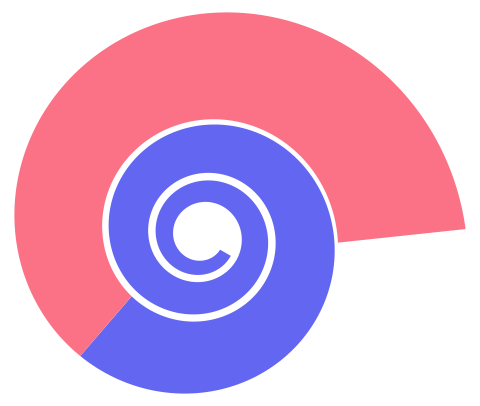

<br />
<br />

<div align="center">
  <a href="https://github.com/YorCreative">
    
  </a>
</div>

<h3 align="center">Argonaut DTO</h3>

<div align="center">
<a href="https://github.com/YorCreative/Argonaut-DTO/blob/main/LICENSE"></a>
<a href="https://github.com/YorCreative/Argonaut-DTO/stargazers"></a>

<a href="https://github.com/YorCreative/Argonaut-DTO/issues"></a>
<a href="https://github.com/YorCreative/Argonaut-DTO/network"></a>

<a href="https://github.com/YorCreative/Argonaut-DTO/actions/workflows/tests.yml"></a>
<a href="https://github.com/YorCreative/Argonaut-DTO/actions/workflows/security.yml"></a>
</div>

Framework-agnostic Data Transfer Objects for PHP 8.3+. Argonaut DTO provides the useful parts of Laravel Argonaut DTO
without requiring Laravel: nested DTO and enum casting, recursive serialization, mutable and immutable DTOs,
convention-based assemblers, and lightweight validation.

## Requirements

- PHP 8.3, 8.4, or 8.5

## Installation

Install via Composer:

```bash
composer require yorcreative/argonaut-dto
```

## Basic DTO

```php
use YorCreative\ArgonautDTO\ArgonautDTO;

final class UserDTO extends ArgonautDTO
{
    public string $name;
    public string $email;

    protected array $casts = [
        'name' => 'string',
        'email' => 'string',
    ];

    public function rules(): array
    {
        return [
            'name' => ['required', 'string'],
            'email' => ['required', 'email'],
        ];
    }
}

$user = new UserDTO(['name' => 'Jane', 'email' => 'jane@example.com']);
$user->merge(['name' => 'Jane Doe']);

$user->toArray();
$user->toJson();
$user->isValid();
```

Unknown input keys are ignored. A setter named `set<FieldName>` takes precedence over direct property assignment. Declare `$prioritizedAttributes` when setters must run before the remaining input attributes.

## Named constructors

```php
$profile = ProfileDTO::fromArray(['fullName' => 'Ada Lovelace']);
$profile = ProfileDTO::fromJson('{"fullName":"Ada Lovelace"}');
$tags    = TagDTO::collection([['name' => 'a'], ['name' => 'b']]); // Collection<TagDTO>
```

`fromArray()` and `fromJson()` are new in 1.1.0. `collection()` is not new — it
has existed since 1.0.0 and is listed here because 1.1.0 makes its return type
generic, so static analysis now narrows the elements.

`fromJson()` throws `JsonException` on malformed JSON. It also throws
`JsonException` when the JSON is valid but does not decode to an object — for
example `'null'`, `'"a string"'`, `'123'`, or a JSON array such as
`'[{"fullName":"Ada"}]'` or `'[1,2]'` — with a message naming the type it
found instead, such as `ProfileDTO::fromJson() expects a JSON object, null
given.` An empty array (`'[]'`) is indistinguishable from an empty object
(`'{}'`) once decoded, so both are accepted and produce an empty DTO. All
three named constructors are available on both `ArgonautDTO` and
`ArgonautImmutableDTO`.

## Nested casts

```php
use YorCreative\ArgonautDTO\ArgonautDTO;
use YorCreative\ArgonautDTO\Collection;

final class OrderDTO extends ArgonautDTO
{
    public array $items;
    public Collection $history;
    public ?UserDTO $customer = null;

    protected array $casts = [
        'items' => [OrderItemDTO::class],
        'history' => Collection::class.':'.OrderEventDTO::class,
        'customer' => UserDTO::class,
    ];
}
```

Array casts use `[SomeDTO::class]`. Collection casts use `Collection::class . ':' . SomeDTO::class` (the shorthand `collection:SomeDTO` is also supported). Arrays, traversables, and the package `Collection` can be used as input.

Backed enums and `DateTimeInterface` implementations can be cast directly:

```php
protected array $casts = [
    'status' => OrderStatus::class,
    'createdAt' => DateTimeImmutable::class,
];
```

Nested DTOs and backed enums serialize recursively; enums serialize to their backing values.

## Attribute casting

Casts can be declared with attributes instead of the `$casts` array:

```php
use YorCreative\ArgonautDTO\ArgonautDTO;
use YorCreative\ArgonautDTO\Attributes\CastCollection;
use YorCreative\ArgonautDTO\Attributes\CastEnum;
use YorCreative\ArgonautDTO\Attributes\CastTo;
use YorCreative\ArgonautDTO\Collection;

class OrderDTO extends ArgonautDTO
{
    #[CastTo(CustomerDTO::class)]
    public ?CustomerDTO $customer = null;

    /** @var array<int, LineDTO> */
    #[CastTo(LineDTO::class, many: true)]
    public array $lines = [];

    /** @var Collection<LineDTO> */
    #[CastCollection(LineDTO::class)]
    public ?Collection $lineCollection = null;

    #[CastEnum(Status::class)]
    public ?Status $status = null;
}
```

Each attribute is equivalent to the `$casts` entry it replaces:

| Attribute | Equivalent `$casts` value |
| --- | --- |
| `#[CastTo(LineDTO::class)]` | `LineDTO::class` |
| `#[CastTo(LineDTO::class, many: true)]` | `[LineDTO::class]` |
| `#[CastCollection(LineDTO::class)]` | `'collection:'.LineDTO::class` |
| `#[CastEnum(Status::class)]` | `Status::class` |

Attributes and the `$casts` array can coexist. When both describe the same
property, **the `$casts` array wins**. Attributes are fixed at the point of
property declaration, so a subclass cannot change the attribute on a property it
inherits without redeclaring that property — `$casts` is its lever short of
redeclaration, and this rule keeps that override working:

```php
class ParentDTO extends ArgonautDTO
{
    #[CastTo(TagDTO::class)]
    public mixed $thing = null;
}

class ChildDTO extends ParentDTO
{
    // Overrides the inherited attribute.
    protected array $casts = ['thing' => 'string'];
}
```

Like `$casts`, cast attributes only apply on the direct property-assignment
path. If the DTO declares a `set<Property>()` setter for that property, the
setter runs instead and is responsible for its own conversion — the attribute
is silently never consulted.

## Serialization depth

`toArray()`, `toJson()`, and `jsonSerialize()` walk the whole DTO graph:

```php
$dto->toArray();          // full graph
$dto->toArray(2);         // two levels of nested DTOs
$dto->toJson(depth: 2);   // same limit, JSON encoded
```

`$depth` counts DTO nesting levels and defaults to `ArgonautDTO::DEFAULT_MAX_DEPTH` (512). Exceeding
it throws a `RuntimeException` rather than silently emitting an empty array, so truncation can never
be mistaken for missing data.

Circular references are detected directly, not inferred from the depth limit, and raise
`YorCreative\ArgonautDTO\CircularReferenceException` (a `RuntimeException`) naming the instance
involved. The same DTO appearing in two sibling branches is a shared reference rather than a cycle
and serializes normally.

`toJson()` also accounts for PHP's own `json_encode()` depth limit. Because each array or collection
of DTOs adds a level of its own, a graph well inside `$depth` can still exceed the encoder's 512
levels; `toJson()` raises the encoder limit to fit whatever the walk produced. Note that
`json_decode()` has the same 512 default, so decoding very deep payloads needs an explicit depth.

## Collection

`Collection` is a small, dependency-free collection returned by
`collection:` casts and by `collection()`. It implements `ArrayAccess`,
`Countable`, `IteratorAggregate` and `JsonSerializable`.

It is generic over its value type, so static analysis narrows elements:

```php
/** @var Collection<TagDTO> */
public Collection $tags;

$this->tags->first()->name; // PHPStan resolves this to TagDTO::$name
```

Available methods:

| Method | Returns | Notes |
| --- | --- | --- |
| `all()` | `array` | Underlying items, keys preserved |
| `map(callable)` | `Collection` | Preserves keys |
| `filter(?callable)` | `Collection` | Callback receives value and key |
| `first(mixed $default = null)` | `TValue\|null` | |
| `last(mixed $default = null)` | `TValue\|null` | |
| `reduce(callable, mixed $initial = null)` | `mixed` | Callback receives carry, value, key |
| `contains(mixed)` | `bool` | A value compared strictly, or a predicate |
| `pluck(string $value, ?string $key = null)` | `Collection` | Reads array keys, `ArrayAccess` offsets, or object properties |
| `groupBy(callable)` | `Collection` | A `Collection` of `Collection`s |
| `keyBy(callable)` | `Collection` | Later duplicates win |
| `values()` | `Collection` | Reindexes |
| `isEmpty()` / `isNotEmpty()` | `bool` | |
| `count()` | `int` | |

These mirror the names and common calling conventions of
`Illuminate\Support\Collection` so the API is familiar, but deliberately omit
Laravel's operator overloads — `contains()` takes a value or a predicate, not
`($key, $operator, $value)`.

One caveat worth knowing: `contains()` decides between "value" and "predicate" by
testing `instanceof Closure`, so a collection whose *items are themselves
closures* cannot be searched by value — the argument is always invoked as a
predicate. `Illuminate\Support\Collection` has the same limitation. Use
`in_array($needle, $collection->all(), true)` if you need that.

## Immutable DTOs

Declare DTO properties as `readonly` and extend `ArgonautImmutableDTO`:

```php
final class UserSnapshotDTO extends ArgonautImmutableDTO
{
    public readonly string $id;
    public readonly string $name;
}
```

Readonly properties are initialized once during construction. Missing required properties remain uninitialized, allowing PHP's normal typed-property error to identify an incomplete snapshot.

## Assemblers

Assemblers resolve `to<ClassName>` first, then `from<ClassName>`:

```php
final class UserAssembler extends ArgonautAssembler
{
    public static function toUserDTO(object $input): UserDTO
    {
        return new UserDTO([
            'name' => $input->display_name,
            'email' => $input->email,
        ]);
    }
}

$user = UserAssembler::assemble($payload, UserDTO::class);
$users = UserAssembler::fromArray($payloads, UserDTO::class);
```

`fromArray()` and `fromCollection()` return the package's dependency-free `Collection`, which supports iteration, array access, `count()`, `first()`, `all()`, `map()`, and `filter()`.

Instance assembler methods are supported through `assembleInstance()` or by passing an assembler instance to `assemble()`.

## Validation

`rules()` uses [YorCreative DataValidation](https://packagist.org/packages/yorcreative/data-validation), including its complete rule set, nested paths, wildcards, and custom closures. Argonaut preserves the convenient `int`, `bool`, `collection`, and `sometimes` aliases: collections are arrays after serialization, and `sometimes` omits the rule set when the field is absent.

Custom closures use DataValidation's signature: `function (string $field, mixed $value, callable $fail, array $data): bool`.

```php
$errors = $user->validate(throw: false);
// ['email' => ['The email field failed the email rule.']]
```

Calling `validate()` without `throw: false` raises `YorCreative\ArgonautDTO\ValidationException`.

`isValid()` returns `false` only for validation failure. A missing or broken `rules()` method is a
programming error and surfaces as an exception rather than being reported as invalid data. Pass
`isValid(throw: true)` to raise `ValidationException` instead of returning `false`.

## Relationship to the Laravel package

`yorcreative/argonaut-dto` contains no Illuminate dependency. The Laravel package can provide Laravel-specific adapters and continue to expose its existing API while sharing this framework-neutral behavior. Laravel applications that need Laravel's validator or collection implementation can remain on `yorcreative/laravel-argonaut-dto`.

## Testing

Run the test suite:

```bash
composer test
```

Run tests with coverage report:

```bash
composer coverage
```

Run static analysis (PHPStan):

```bash
composer phpstan
```

Run code style fixer (Pint):

```bash
composer lint
```

Continuous integration runs the suite on PHP 8.3, 8.4, and 8.5 against locked, lowest, and highest dependency sets,
alongside PHPStan, Pint, Composer validation, GitHub dependency review, and scheduled Composer security audits.

## Credits

- [Yorda](https://github.com/yordadev)
- [All Contributors](../../contributors)

## License

This package is open-sourced software licensed under the [MIT license](LICENSE).
